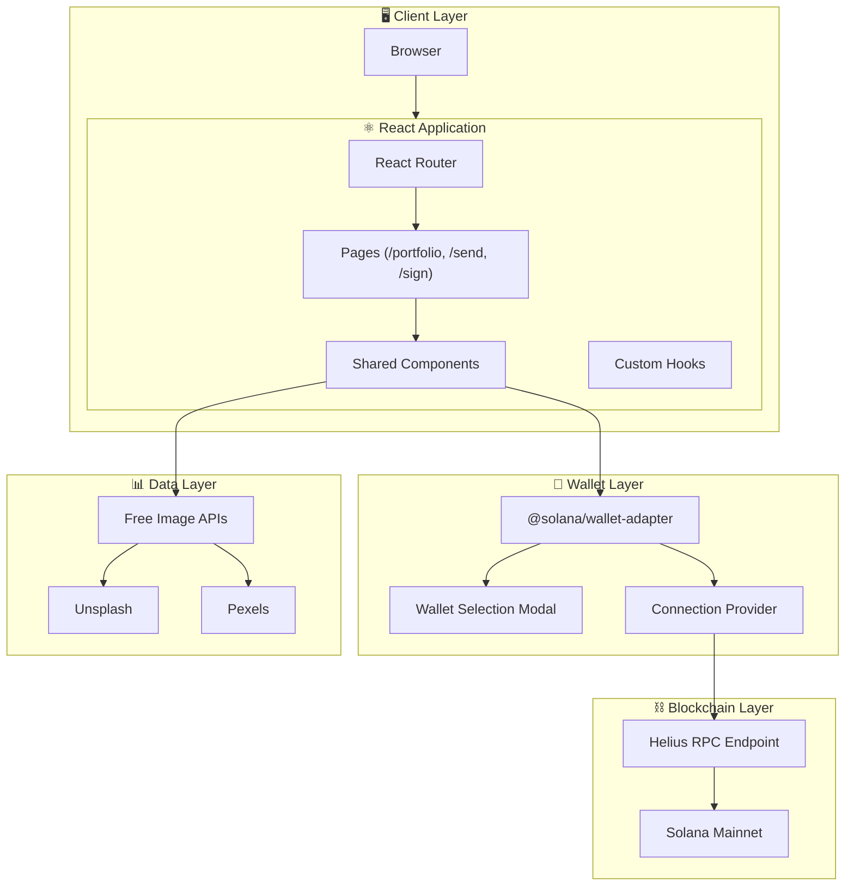
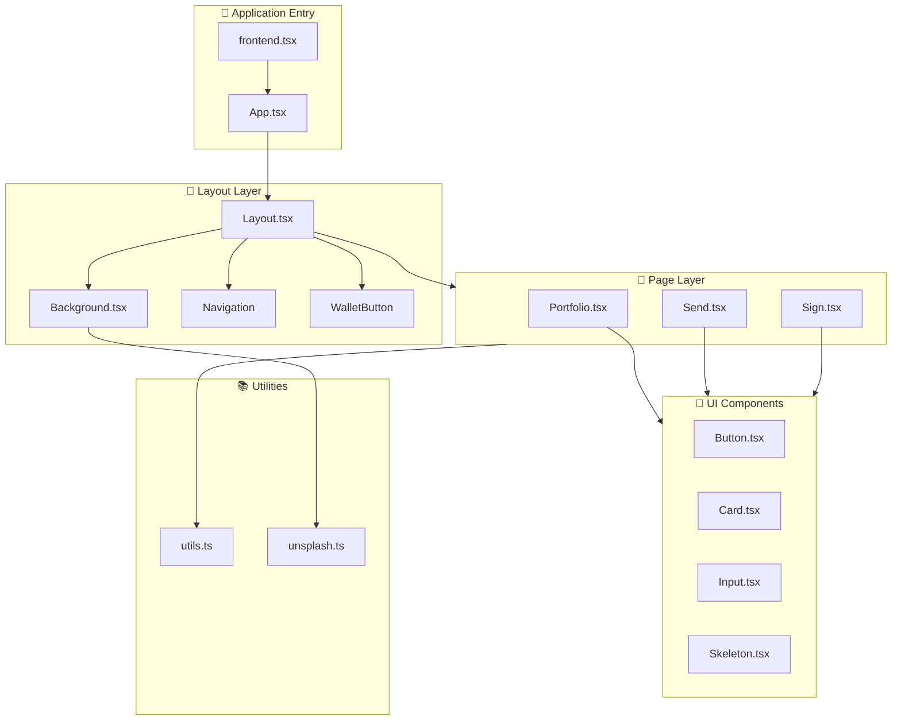
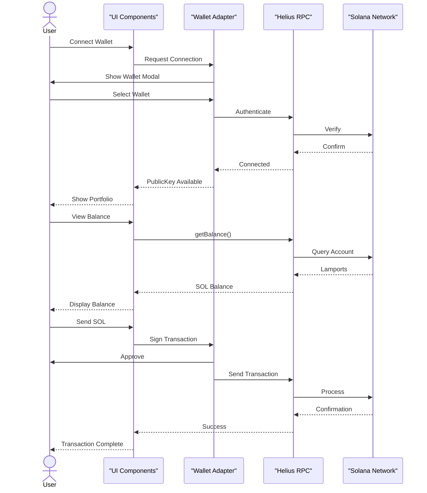
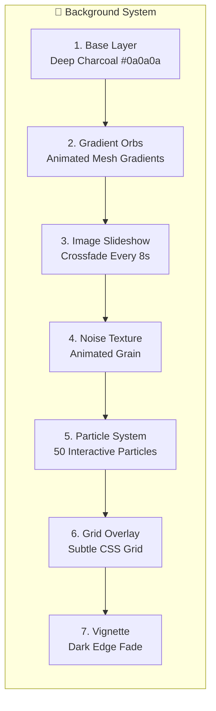
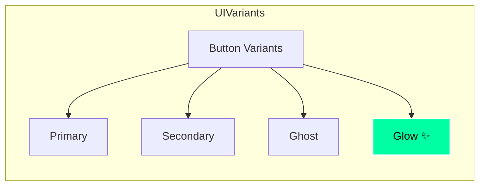
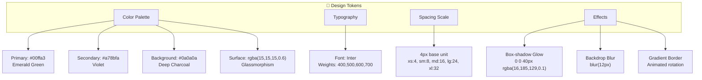
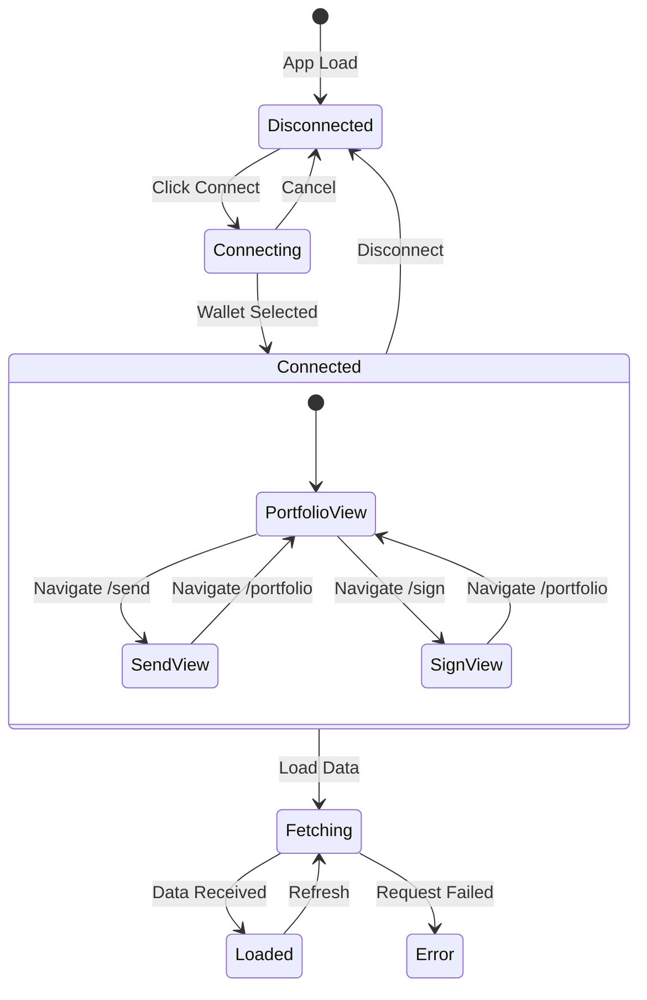
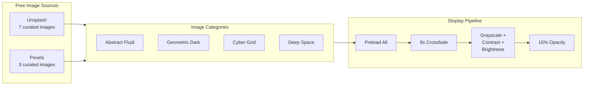

# Solana Wallet Adapter dApp

A premium Web3 dApp built with React, TypeScript, and Solana wallet adapter. Features a multi-page architecture with stunning dark-themed UI, interactive animations, and real-time blockchain data.


---

## 🏗️ System Architecture



---

## 📁 Component Architecture



---

## 🔄 Data Flow Architecture



---

## 🎭 Background Animation System



---

## 🧩 Component Details

### Layout System
| Component | Purpose | Key Features |
|-----------|---------|--------------|
| `Layout.tsx` | App shell structure | Persistent nav, wallet button, background |
| `Background.tsx` | Animated background | 10 free images, particles, gradients |
| Navigation | Route links | Active state animation, hover glow |
| WalletButton | Connect/disconnect | shadcn/ui styling, adapter integration |

### Page Components
| Page | Functionality | Interactive Elements |
|------|---------------|---------------------|
| `Portfolio.tsx` | Dashboard view | Price chart, transaction history, live indicator |
| `Send.tsx` | Transfer SOL | Form validation, amount input, recipient field |
| `Sign.tsx` | Message signing | Textarea input, signature display |

### UI Components (shadcn/ui based)


---

## 🎨 Visual Design System



---

## ⚡ State Management Flow



---

## 🖼️ Image Architecture



---

## 🛠️ Tech Stack

| Category | Technology | Purpose |
|----------|------------|---------|
| **Runtime** | Bun 1.3 | Fast JS runtime, bundler, dev server |
| **Framework** | React 18 | UI library with hooks |
| **Language** | TypeScript | Type safety |
| **Styling** | Tailwind CSS | Utility classes |
| **UI** | shadcn/ui | Component primitives |
| **Animation** | Framer Motion | Page transitions, micro-interactions |
| **Blockchain** | @solana/web3.js | Solana interactions |
| **Wallet** | @solana/wallet-adapter | Wallet connection |
| **Icons** | Lucide React | Icon library |

---

## 🚀 Getting Started

```bash
# Install dependencies
bun install

# Start development server
bun dev

# Build for production
bun build ./src/index.html --outdir=dist --target=browser
```

### Environment Variables (Optional)
```bash
# For enhanced Unsplash features (not required - free images work without key)
BUN_PUBLIC_UNSPLASH_ACCESS_KEY=your_key_here
```

---

## 📱 Features

- ✅ Multi-page SPA with React Router
- ✅ 10 free background images (Unsplash + Pexels)
- ✅ Interactive particle system (50 particles, mouse-reactive)
- ✅ Animated mesh gradient orbs
- ✅ Live balance updates (30s refresh)
- ✅ Price chart visualization
- ✅ Transaction history mock
- ✅ Glassmorphism UI cards
- ✅ Gradient border animations
- ✅ Full wallet adapter integration
- ✅ TypeScript throughout

---

## 🔒 Security

- No private keys stored
- Wallet adapter handles all signing
- RPC calls via Helius (mainnet)
- No API keys required for images (free tier)

---

Built with ⚡ by the Web3 community
